#  Bus Reservation System – Full Stack Application

A full-stack bus booking application built with **Flutter (frontend)** and **Spring Boot (backend)**.  
Features **JWT authentication, real-time seat booking, MySQL integration, admin panel, and REST APIs**.

---

## 🚀 Tech Stack
- **Frontend:** Flutter, Provider (state management)
- **Backend:** Spring Boot, MySQL, JWT Authentication, REST APIs, MVC Architecture  
- **Tools:** Git, Maven, Postman, IntelliJ IDEA 

---

## 📂 Project Repositories
- 🔗 [Frontend (Flutter)](https://github.com/YourUsername/FrontendRepoLink)  
- 🔗 [Backend (Spring Boot)](https://github.com/YourUsername/BackendRepoLink)  

---

## ✨ Features
- User authentication with JWT  
- Real-time seat booking system  
- MySQL database for persistent storage  
- Admin panel to add/manage buses and routes  
- RESTful APIs designed with MVC architecture  
- State management with Provider in Flutter  

---

## 🛠️ Getting Started
1. Clone the repositories from the links above.  
2. Set up the **backend** (`mvn spring-boot:run`).  
3. Run the **frontend** in Flutter (`flutter run`).  

---

## 📸 Screenshots (optional)
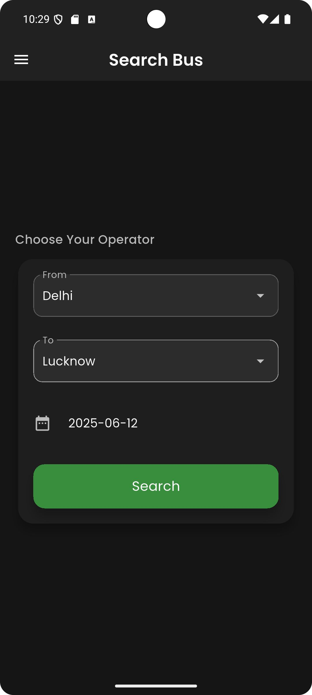
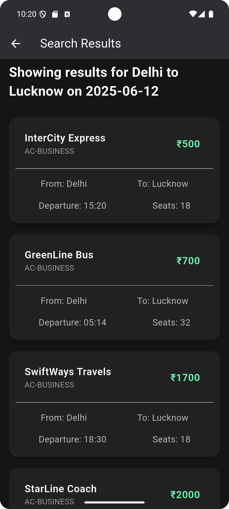
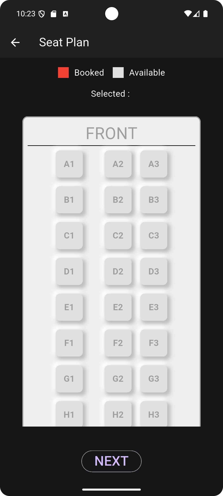
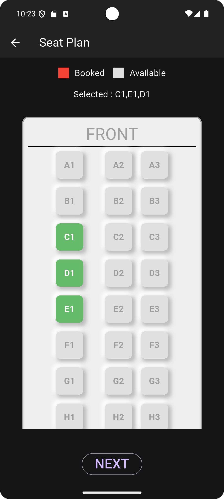
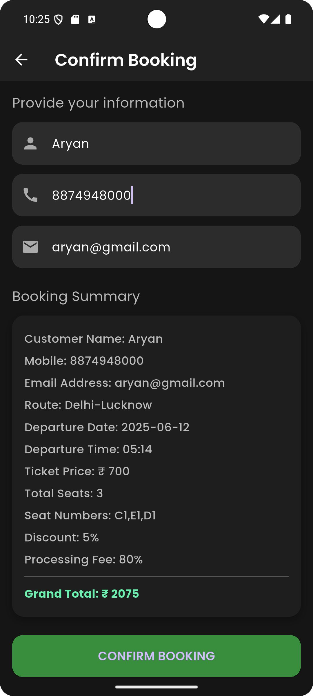
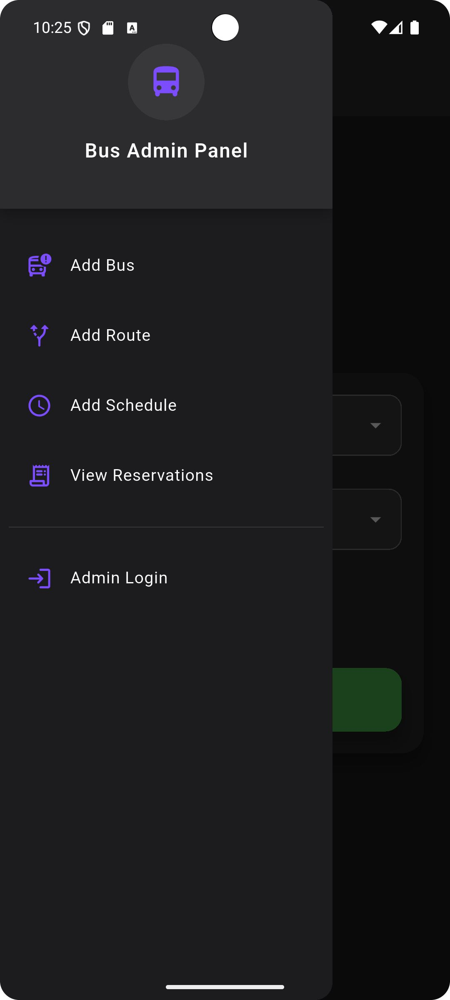
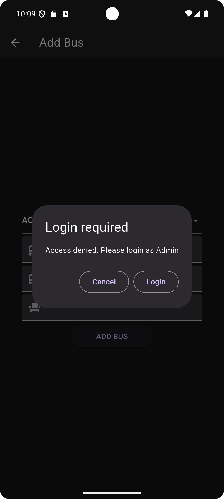
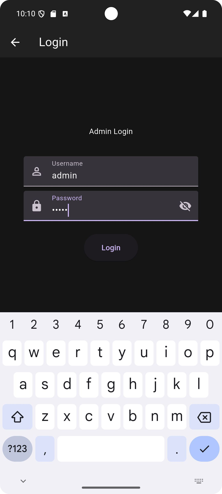
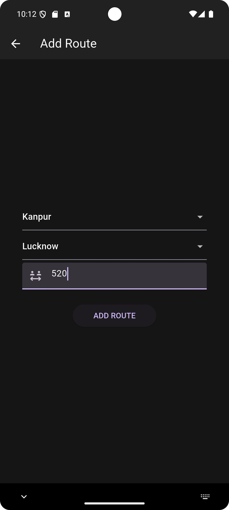
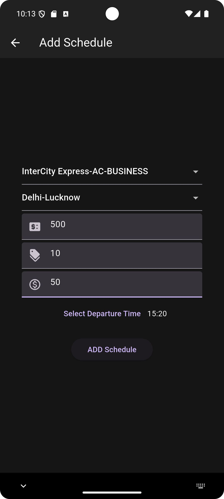
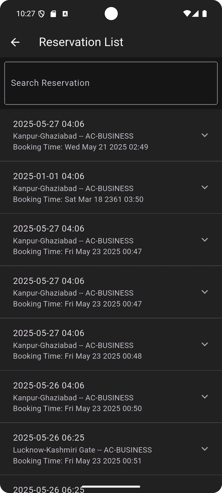

